# ESG 전략 챗봇 (ESG Strategy Chatbot)
### RAG 기반 기업 맞춤형 ESG 어시스턴트

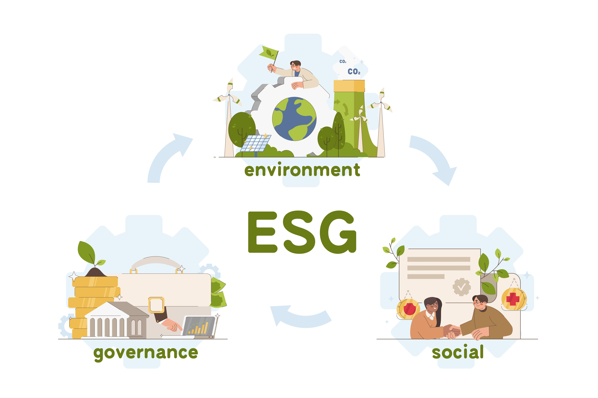

ESG(환경·사회·지배구조) 지속가능경영 보고서를 기반으로,
기업 임원진에게 **전략적 ESG 인사이트**를 제공하는 **RAG 기반 챗봇 시스템**입니다.

## 👨‍👩‍👧‍👦 팀 소개

### 팀명: 김이박최

| **김원우** | **이정민** | **이지복** | **박진양** | **최문영** |
|:----------:|:----------:|:----------:|:----------:|:----------:|
|  |  |  | 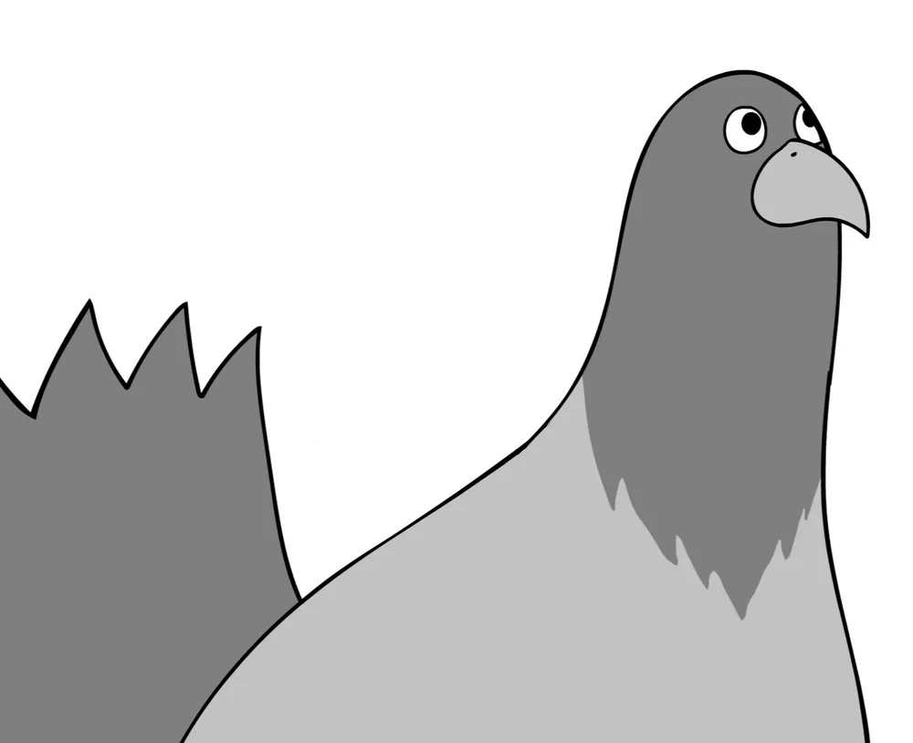 |  |

## 🛠 기술 스택

| **구분**                | **기술 스택**                                                                                                   |
| ----------------------- | ----------------------------------------------------------------------------------------------------------- |
| **Backend**             |        |
| **Frontend**            |                                    |
| **DevOps & Deployment** |                                                       |

## 🔍 프로젝트 필요성
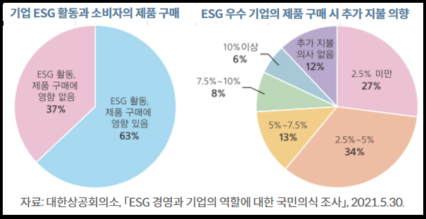
* MZ세대의 72%가 ESG를 들어봤지만, 정확히 아는 비율은 단 6%
* 70% 이상의 소비자가 ESG 부정적 기업의 제품을 의도적으로 회피
* 기업의 ESG 전략은 생존과 브랜드 신뢰도에 직결됨

따라서, **정보 전달을 넘어 전략적 의사결정을 지원하는 도구가 필요**합니다. 
이 챗봇은 기존 GPT 기반 챗봇과 달리, **RAG 기반 문서 검색 및 분석으로 실질적 조언을 제공**합니다.

## 🎯 프로젝트 개요

**ESG 경영은 이제 선택이 아닌 <u>필수</u>입니다.**  
그러나 많은 기업들이 ‘지속가능성’의 중요성은 인식하면서도 구체적으로 *어떻게 전략에 반영할 것인가*에 대해선 막막함을 느끼곤 합니다.

저희는 이런 고민을 해결하기 위해, **우수기업들의 ESG 전략을 기반으로 사용자 기업의 방향성을 제시해주는 챗봇**을 개발했습니다.

  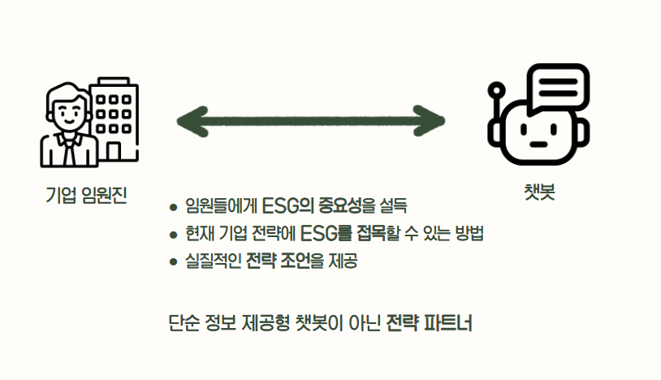

- **우수기업들의 ESG 보고서** 기반으로 전략 요소를 추출
- 기업 전략과 ESG 연계 방안을 **챗봇 형태로 안내**
- 다양한 기업 사례와 메타데이터 기반으로 **실제 전략 설계에 도움** 제공

## 📅 프로젝트 기간 (2025년 6월 26일 ~ 6월 27일)

### WBS
- **프로젝트 기획**: 2025년 06월 26일 9시 ~ 15시
    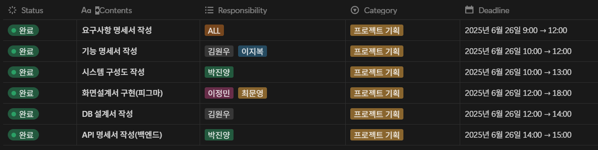
- **프로젝트 착수**: 2025년 06월 26일 15시 ~ 6월 27일 14시
    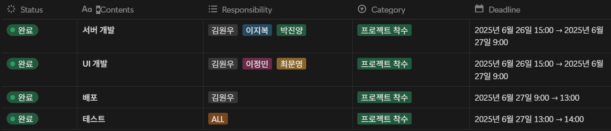
- **프로젝트 완료**: 2025년 06월 27일 9시 ~ 17시
    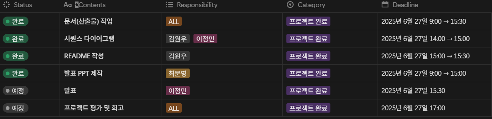

---

### 시스템 아키텍처

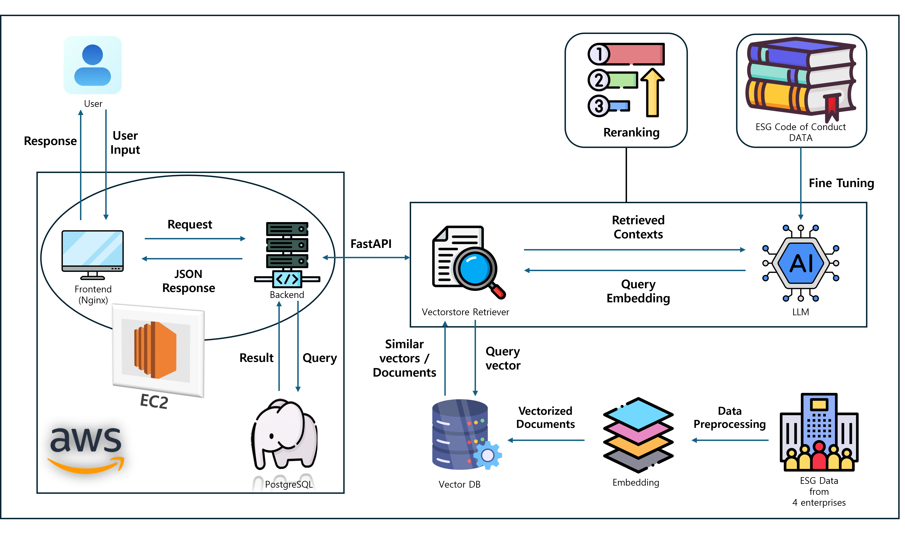

## 📋 요구사항 정의서

### 기능적 요구사항

#### 1. 사용자 관리
- **회원가입**: 이메일 기반 회원가입
- **로그인/로그아웃**: JWT 토큰 기반 인증
- **이메일 인증**: 회원가입 시 이메일 인증 필수
- **아이디/비밀번호 찾기**: 이메일을 통한 계정 복구
- **마이페이지**: 사용자 정보 관리 및 대화 히스토리 조회

#### 2. 챗봇 서비스
- **질문-답변**: 자연어 질문에 대한 ESG 관련 답변
- **멀티 채팅룸**: 여러 대화 세션 동시 관리
- **대화 히스토리**: 이전 대화 내용 저장 및 조회
- **문서 검색**: 관련 ESG 문서 자동 검색 및 참조

#### 3. 피드백 시스템
- **답변 평가**: 좋음/보통/나쁨 3단계 평가
- **상세 피드백**: 텍스트 기반 상세 피드백 입력
- **피드백 분석**: 사용자 피드백 통계 및 분석

## 📝 요구사항 명세서

#### 1. 인증 관리 시스템

#### 2. 사용자 관리 시스템

#### 3. 서비스 소개 시스템

#### 4. 챗봇 질문-답변 및 피드백 시스템

## 🗂 ERD (Entity Relationship Diagram)

### ERD 다이어그램
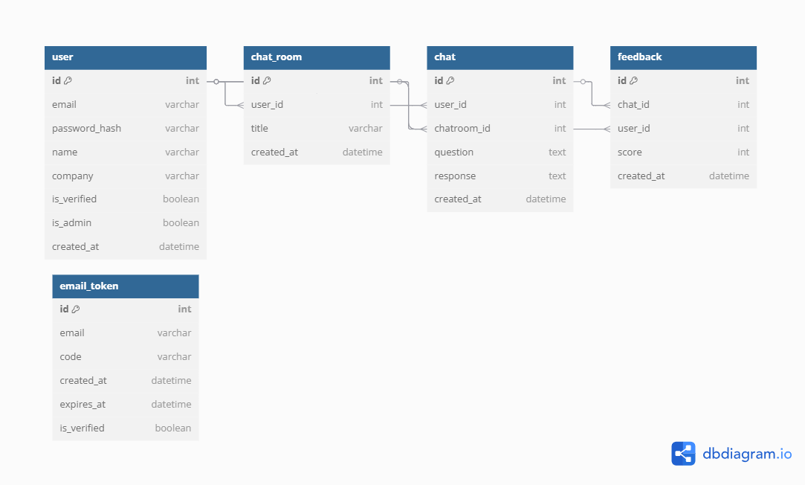

### 엔티티 관계 설명

#### 1. 사용자 (users)
- **주요 엔티티**: 시스템의 모든 사용자 정보
- **관계**: 
  - 1:N → chat_rooms (한 사용자가 여러 채팅룸 보유)
  - 1:N → email_tokens (한 사용자가 여러 인증 토큰 보유)

#### 2. 채팅룸 (chat_rooms)
- **주요 엔티티**: 사용자별 대화 세션
- **관계**:
  - N:1 → users (여러 채팅룸이 한 사용자에게 속함)
  - 1:N → chats (한 채팅룸에 여러 대화 포함)

#### 3. 대화 (chats)
- **주요 엔티티**: 개별 질문-답변 쌍
- **관계**:
  - N:1 → chat_rooms (여러 대화가 한 채팅룸에 속함)
  - 1:N → feedbacks (한 대화에 여러 피드백 가능)

#### 4. 피드백 (feedbacks)
- **주요 엔티티**: 사용자 답변 평가
- **관계**:
  - N:1 → chats (여러 피드백이 한 대화에 속함)

#### 5. 이메일 토큰 (email_tokens)
- **주요 엔티티**: 이메일 인증 토큰
- **관계**:
  - N:1 → users (여러 토큰이 한 사용자에게 속함)

## 🔧 기술 명세서
### API 명세

#### 1. 인증 API

#### 2. 이메일 API

#### 3. 사용자정보 API

#### 4. 채팅방 API

#### 5. 채팅 API

#### 6. 피드백 API

## 🎨 화면설계서

### 화면 구성

#### 1. 메인 페이지 (index.html)
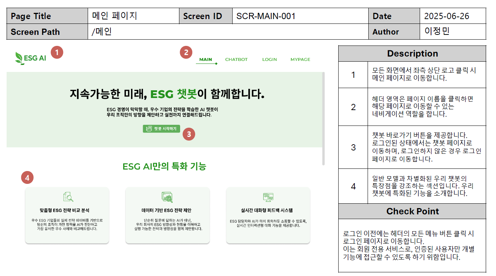
#### 2. 로그인 페이지 (login.html)
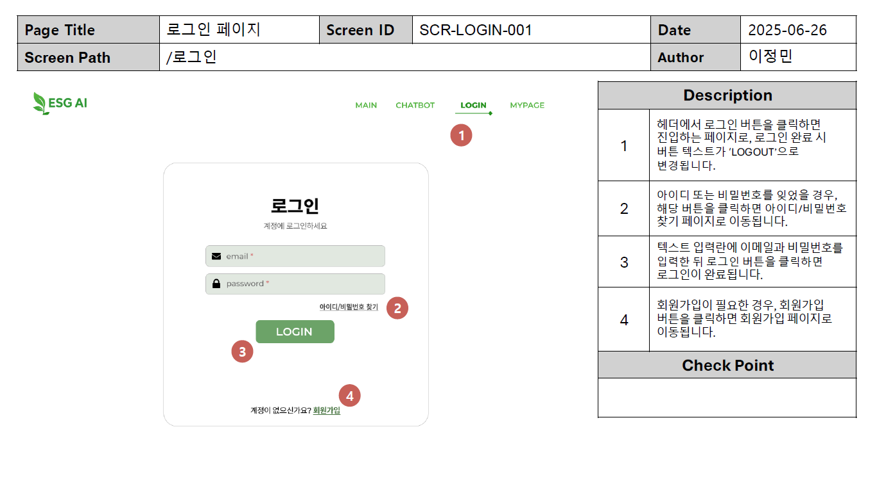

#### 3. 회원가입 페이지 (register.html)
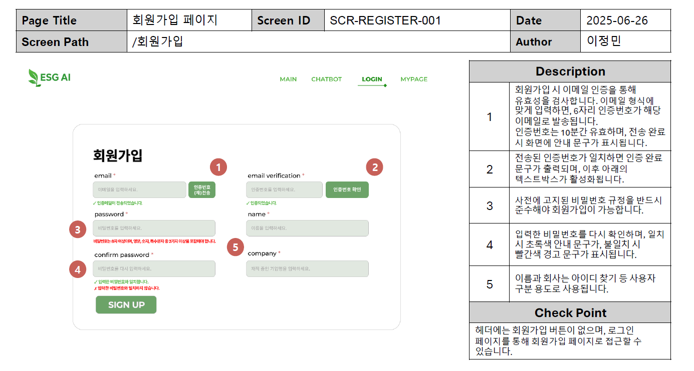

#### 4. 챗봇 페이지 (chatbot.html)
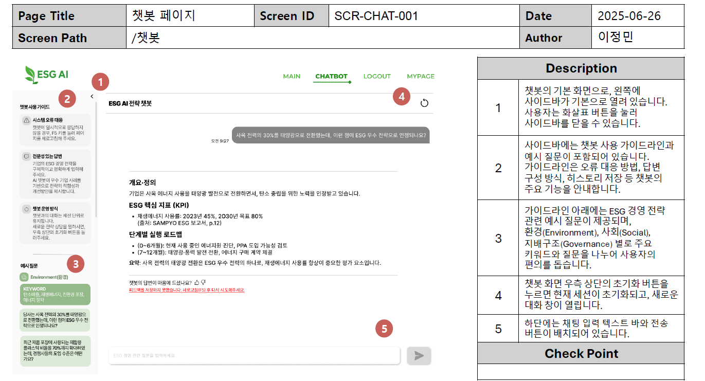

#### 5. 마이페이지 (mypage.html)
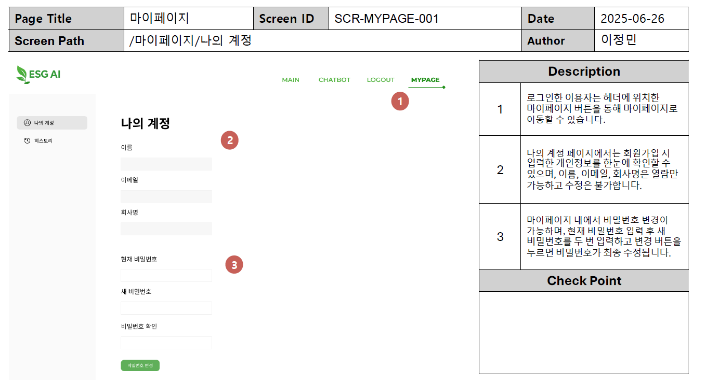

## 🚀 배포

### 배포 환경

#### 1. 개발 환경
- **로컬 개발**: Docker Compose 기반
- **포트**: 
  - Frontend: 80
  - Backend: 8000
  - Database: 5432
- **데이터베이스**: PostgreSQL (Docker 컨테이너)

#### 2. 운영 환경
- **클라우드**: AWS EC2
- **인스턴스 타입**: t3.medium
- **운영체제**: Ubuntu 20.04 LTS
- **웹서버**: Nginx
- **SSL**: Let's Encrypt 인증서

## 🧪 테스트 계획 및 결과 보고서

### 테스트 전략

#### 1. 테스트 범위
- 메인 페이지 및 내비게이션: 메인 페이지 진입, 주요 버튼 및 탭 이동, 페이지 내 이동 경로
- 회원가입 및 인증: 이메일 인증, 개인정보 입력, 비밀번호 생성 및 확인, 회원가입 완료
- 로그인 및 계정 관련 기능: 로그인, 회원가입/비밀번호 찾기/이메일 찾기 페이지 이동, 계정 찾기 및 재설정
- 챗봇 기능: ESG 관련 질의응답, 답변 평가(피드백), 예시 질문 클릭, 사이드바 조절 등 챗봇과 관련된 모든 사용자 인터랙션
- 마이페이지 기능: 비밀번호 변경, 대화 기록 확인, 히스토리 조회 및 재질문 등 마이페이지 내 기능 

#### 2. 테스트 환경
- **개발 환경**: 로컬 Docker 환경
- **스테이징 환경**: AWS EC2 테스트 인스턴스
- **운영 환경**: 실제 배포 환경

### 테스트 케이스

#### 1. 메인 페이지

#### 2. 회원가입 페이지

#### 3. 로그인 페이지

#### 4. 챗봇 페이지

#### 5. 마이 페이지

## 🗣️ 프로젝트 한줄 회고

| 이름 | 한 줄 회고 |
|------|------------|
|**김원우**| 3차 프로젝트부터 진행했던 팀원들과 함께 4차까지 마무리 할 수 있어서 정말 좋았고 감사했습니다! 이번 프로젝트를 하며 더욱 성장할 수 있었던 것 같습니다! 다들 고생하셨어요! |
|**이정민**| 동일한 팀원들과 함께 3차 프로젝트에서 구현했던 챗봇을 확장해 실제 웹서비스로 배포하게 되어 더욱 의미있었습니다. 발표를 맡아서 프론트와 백엔드 간의 흐름을 전체적으로 이해하는 데 큰 도움이 되었고, 팀원 모두 각자의 역할에 책임감 있게 임해줘 협업 과정도 매우 만족스러웠습니다. 팀워크의 중요성을 다시 한 번 느끼게 되었습니다. 최고~ |
|**이지복**| 3차 프로젝트가끝나고 처음 접하는 백엔드 프론트 용어들을 짧은시간동안 소화하기에
벅찬 순간들이 있었지만 팀원들과 프로젝트 하면서 많이 배웠습니다. 또 하나의 결실을 맺는데 서로 도움을 줬던 팀원들 너무 고생 많았고 감사합니다. 파이널 프로젝트도 화이팅! |
|**박진양**| 3차 프로젝트에 이어 12기 최고의 멤버들과 함께 4차 프로젝트를 무사히 완료할 수 있어서 너무 기쁩니다.
프로젝트 기획부터, 백엔드와 프론트엔드 설계, 산출물 문서 작업, 웹 서비드 배포 등 팀원들에게 배운게 엄청 많습니다. 항상 감사합니다!! 정말 최고였어요!! 품위와 격이 다른 김이박최!! |
|**최문영**| 좋은 팀원들과 함께 3차에서 했던 프로젝트를 발전시켜 더 좋은 결과물을 낼 수 있어서 뿌듯했습니다! 팀원 모두가 열정있게 참여하였기 때문에 좋은 결과가 나올 수 있었던 것 같습니다. 여러분 가지 마세요 ~ ㅜ,ㅜ |

**ESG 전략 챗봇** - 지능형 ESG 정보 제공 서비스
**프로젝트 완료일: 2025년 06월 27일**

 

